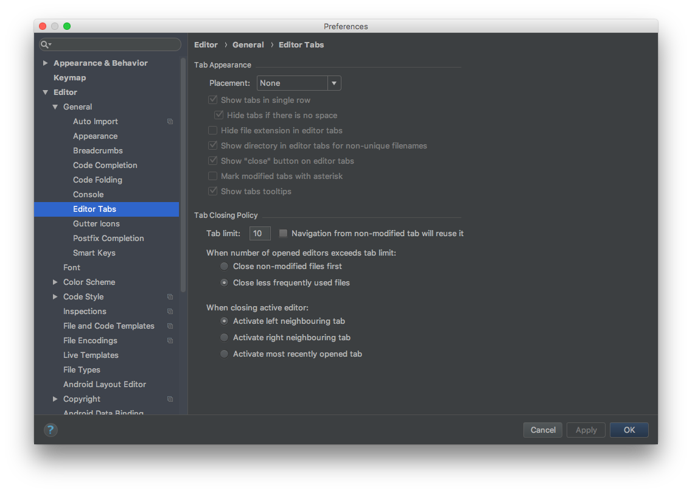

[Top](README.md) => [IntelliJ on OS X](ij-osx.md)

# JetBrains IntelliJ IDEA on Mac OS X

### Navigate the IDE

**Useful sequences to remember**

- ⌃⌘F (Ctrl + Command + F) - toggle full screen
- ⌘⇧fnF12 (Command + Shift + Fn + F12) - toggle maximize editor tab
- ⌥↖︎ (Option + Home) or fn⌥← (Fn + Option + Left Arrow) - show navigation bar
- ⌃⇥ (Ctrl + Tab) - Switcher
- ⌃` (Ctrl + Backtick) - Switch...
  1. Color Scheme
  2. Code Style Scheme
  3. Keymap
  4. View Mode <= _of interest here_
  5. Look and Feel
- ⇧⌘] (Shift + Command + ]) - go to editor tab to the right
- ⇧⌘[ (Shift + Command + [) - go to editor tab to the left
- ⌘] (Command + ]) - go to next editor tab in history
- ⌘[ (Command + [) - go to previous editor tab in history

**Toggle various panes**

- ⌘0 (Command + 0) - toggle messages pane
- ⌘1 (Command + 1) - toggle project view
- ⌘2 (Command + 2) - toggle favorites view
- ⌘4 (Command + 4) - toggle run view
- ⌘7 (Command + 7) - toggle structur view
- ⌘9 (Command + 9) - toggle version control view
- ⌘; (Command + Semicolon) - open Project Structure dialog
- ⌘, (Command + Comma) - open Preferences dialog
- ⌘E (Command + E) - show list of recently-opened files

You can press ⎋ (Escape) or ⌘W (Command + W) to close whichever view has focus.

**Use Switcher to navigate between panes**

- Press and hold ⌃⇥ (Ctrl) and press ⇥ (Tab) to open the Switcher dialog. When you release the (Ctrl) key, the dialog closes.
- The Switcher dialog has two panes. The left-hand pane has a list of navigation options corresponding to the key sequences listed above. Try them.
- The right-hand pane has a list of all open editor table. Use the ↓ (Down Arrow) and ↑ (Up Arrow) keys to move through the list. Press ⏎ (Return/Enter) to make a selection. Focus moves to the selected editor tab.
- With Switcher open, you can press ⌫ (Return/Backspace) to close an open file and remove it from the list. Handy way to close selected files.

**Change viewing modes**

JetBrains IDEs offer standard, distraction-free, and presentation viewing modes.

- Press ⌃` (Ctrl + Backtick) to open the mode switching dialog. This dialog behaves differently than the Switcher. It will remain open until you make a selection from the list. Use ↓ (Down Arrow) and ↑ (Up Arrow) to highlight the viewing mode you want and press ⏎ (Return/Enter), or press the number key corresponding to the menu option you want.
- Choose 4 to change the view mode. Select from the available options.

**Using the IDE without editor tabs**

If you are not using editor tabs, use Switcher to navigate between open files as described above. Switcher will highlight the name of the file you were last editing, so it's easy to switch back and forth between two files.

**How to disable editor tabs**

Tabs are enabled by default. Some people prefer to disable tabs to leave more screen real estate available for the editor window.

Press ⌘, (Command + Comma) to open the Preferences dialog. Navigate to Editor => General => Editor Tabs. Under Tab Appearance, choose "None" in the Placement drop-down. It looks like this:

